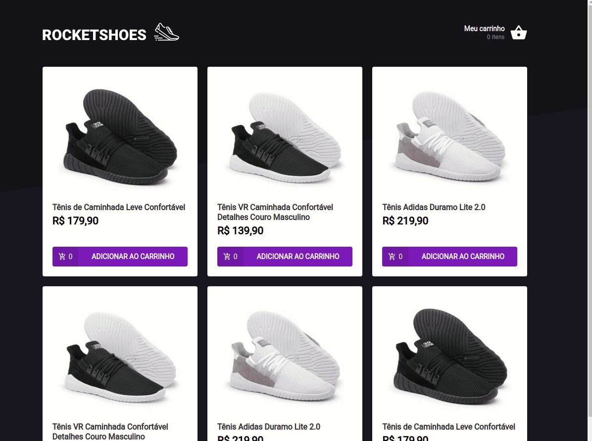

# RocketShoes

Aplicação dt rocketshoes foi criada na trilha de ReactJS do Ignite da Rocketseat. A aplicação é apresnta um crrinho de compras onde é possível escolher produtos e suas quantidades. É possível ainda visualizar a lista dos itens selecionados bem como total e subtotal da compra.

# Imagem da aplicação

<p align="center">
  
</p>

## Execução

Dentro da pasta do projeto, execute

```bash
yarn
yarn server
```

Em outro terminal execute

```bash
yarn start
```

## Licença

[MIT](https://choosealicense.com/licenses/mit/)
